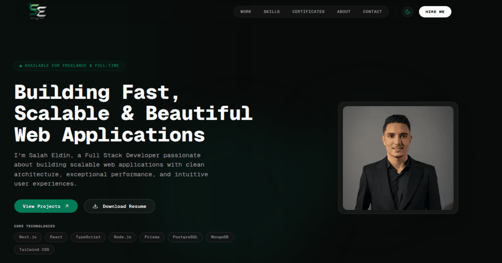

Salah Eldin Portfolio
=====================

Modern personal portfolio built with Next.js, React, TypeScript, and Tailwind CSS.

[](https://nextjs.org/)
[](https://react.dev/)
[](https://www.typescriptlang.org/)
[](https://tailwindcss.com/)
[](https://www.framer.com/motion/)

---

## Preview



## Live Demo

Live site: [https://salah-eldin-ivory.vercel.app](https://salah-eldin-ivory.vercel.app)


---

# ✨ Features

### 👋 Hero

- Modern and responsive hero section
- Smooth entrance animations
- Interactive technology stack
- Download CV & contact actions
- Optimized for all screen sizes

### 👨‍💻 About

- Personal introduction
- Development approach
- Current learning focus
- Quick professional information

### 🛠 Skills

- Skills grouped by category
- Interactive ambient glow effect
- Smooth stagger animations
- Optimized hover interactions
- Supports reduced motion

### 🚀 Projects

- Interactive project explorer inspired by IDEs
- Project overview
- Features
- Technology stack
- Responsive gallery
- GitHub & Live Demo actions
- Animated tab transitions

### 📜 Certificates

- Professional certificates showcase
- PDF certificate viewer
- Clean responsive layout
- Direct certificate access

### 📬 Contact

- Quick contact section
- Email
- GitHub
- LinkedIn

### 🌙 Theme

- Light Mode
- Dark Mode
- Theme persistence

---


# 🧰 Tech Stack

| Category | Technologies |
|----------|--------------|
| Framework | Next.js 16 |
| Language | TypeScript |
| UI | React |
| Styling | Tailwind CSS |
| Animation | Framer Motion |
| Package Manager | npm |
| Deployment | Vercel |

---

# 🧱 Architecture

The project follows a **Feature-Based Architecture** to improve scalability and maintainability.

```text
app/
├── favicon.ico
├── icon.png
├── apple-icon.png
├── layout.tsx
├── page.tsx
├── robots.ts
├── sitemap.ts
└── not-found.tsx

components/
├── ui/

modules/
  home/
    └── features/
        ├── hero/
            ├── components/
            ├── hero.tsx
        ├── about/
        ├── skills/
        ├── projects/
        ├── certificates/
        └── contact/
lib/
public/

```

## Getting Started

```bash
git clone https://github.com/salaheldin404/my-portfolio.git
cd my-portfolio
npm install
```

Create a `.env.local` file before running the app:

```env
NEXT_PUBLIC_SITE_URL=http://localhost:3000
# Optional
GOOGLE_VERIFICATION_CODE=
```

Run the development server:

```bash
npm run dev
```

Open [http://localhost:3000](http://localhost:3000) in your browser.

Useful scripts:

```bash
npm run build
npm run lint
```

---

# ⚡ Performance

The portfolio was built with performance as a first-class priority.

Highlights include:

- GPU accelerated animations
- Optimized rendering
- Lightweight Framer Motion usage
- Lazy loading where appropriate
- Optimized image loading
- Feature-based architecture
- Lighthouse-friendly implementation

---

## Deployment

The portfolio is deployed on Vercel.

1. Connect the GitHub repository to Vercel.
2. Set `NEXT_PUBLIC_SITE_URL` to the production domain in the Vercel project settings.
3. Add `GOOGLE_VERIFICATION_CODE` if you want Google Search Console verification in production.
4. Deploy from the `main` branch and let Vercel handle previews for future commits.

Live site: [https://salah-eldin-ivory.vercel.app](https://salah-eldin-ivory.vercel.app)

---

## Author

| Field | Value |
| --- | --- |
| Name | Salah Eldin |
| Role | Full Stack Developer |
| GitHub | [@salaheldin404](https://github.com/salaheldin404) |
| LinkedIn | [salah-eldin-ahmed-389471221](https://www.linkedin.com/in/salah-eldin-ahmed-389471221/) |
| Portfolio | [salah-eldin-ivory.vercel.app](https://salah-eldin-ivory.vercel.app) |
| Email | [salahlala303@gmail.com](mailto:salahlala303@gmail.com) |

---
